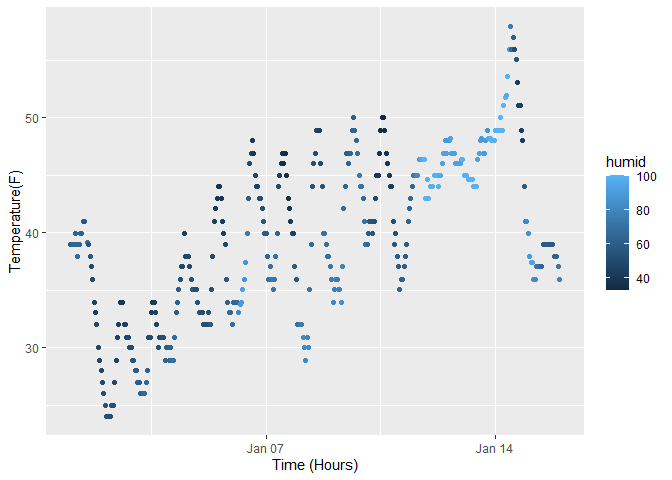

Homework 2
================

# Load library

``` r
library(tidyverse)
```

    ## Warning: package 'tidyverse' was built under R version 4.2.3

    ## Warning: package 'tibble' was built under R version 4.2.3

    ## Warning: package 'readr' was built under R version 4.2.3

    ## Warning: package 'lubridate' was built under R version 4.2.3

    ## ── Attaching core tidyverse packages ──────────────────────── tidyverse 2.0.0 ──
    ## ✔ dplyr     1.1.0     ✔ readr     2.1.4
    ## ✔ forcats   1.0.0     ✔ stringr   1.5.0
    ## ✔ ggplot2   3.4.1     ✔ tibble    3.2.1
    ## ✔ lubridate 1.9.2     ✔ tidyr     1.3.0
    ## ✔ purrr     1.0.1     
    ## ── Conflicts ────────────────────────────────────────── tidyverse_conflicts() ──
    ## ✖ dplyr::filter() masks stats::filter()
    ## ✖ dplyr::lag()    masks stats::lag()
    ## ℹ Use the ]8;;http://conflicted.r-lib.org/conflicted package]8;; to force all conflicts to become errors

``` r
library(moderndive)
```

    ## Warning: package 'moderndive' was built under R version 4.2.3

``` r
library(ggplot2)
```

# Problem 1

``` r
data("early_january_weather")
?early_january_weather
```

    ## starting httpd help server ... done

## Description of the data

This dataset shows weather data on hourly meterological data for LGA,
JFK, and EWR for the month of January 2013. This data frame has 358 and
15 represening hourly measurements of 15 variables. Some of its
variables include temperature, humidity, wind direction&speed&gust
speed, precipitation,etc. The average temperature is 39.5821229.

## Scatterplot

``` r
plot = 
  ggplot(early_january_weather, aes(x=time_hour, y=temp, color=humid))+
  geom_point() + 
  labs( x = "Time (Hours)",
        y = "Temperature(F)")

plot
```

<!-- -->

``` r
ggsave("plot.pdf")
```

    ## Saving 7 x 5 in image

### Description of the graph

The scatterplot shows a non-linear graph between time and temperature.
Due to its being an hourly documentation of temperature, it is usual to
see this pattern as the temperature tends to go down at night, but
rising in the morning. However, overall, we can see an upward trend as
it peaks at about 57 degree while its lowest point being 24 degree.
There maybe a positive correlation between temperature and humidity as
higher temperature leads to higher humidity, but further analysis is
needed to conclude this.
